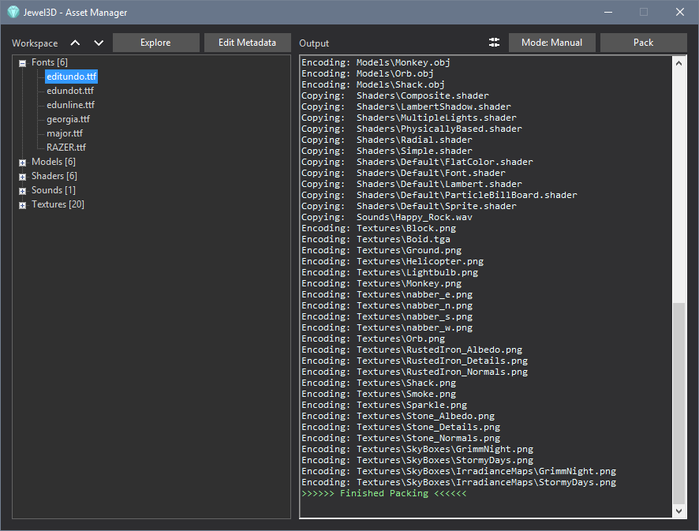

# AssetManager


This tool allows you to easily prepare your assets for run-time use by the framework.

# Workspace
The workspace folder holds all the raw assets that will eventually be used by the game.

# Encoders
An Encoder is a DLL that implements the interface provided by ```Jewel3D\Resource\Encoder.h```.
In the AssetManager, each Encoder is associated with a specific file extension. Assets of that type will be processed using the functions in the Encoder.
Custom Encoders can be created for game-specific assets (levels, items, dialog-trees etc.), allowing you to easily pack game data.

# Metadata
Every asset with an associated encoder has metaData created for it. Metadata is saved adjacent to the asset (```assetName.extension.meta```) as plain text.
The content of the metaData file depends on the encoder. These are the properties used when packing the asset into a binary format.
For instance, .ttf.meta files for fonts specify the output resolution of the generated textures.

Metadata files are automatically updated and added to the workspace while the AssetManager is running.

# Building Assets
Packing the workspace will prepare all assets for use by the game. By default, an output folder called ```Assets``` will be created adjacent to the Workspace.
All assets with an associated Encoder will be converted using the DLL and saved to the Assets folder. Any remaining assets are copied 1:1 to the folder.
The output folder is populated with the same folder structure as the workspace.
